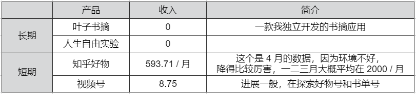

## 人生自由实验
今天开始（2022/5/3），我将做一个实验：[从零实现人生自由](https://github.com/5A59/wonderful-life)。

在这个实验里，**我会把我做的事情（工作以外），以及每件事情的收入都透明公开**，每周更新一次。
（其实最初想把各个账号的细节也公开一下，但是可能会有不少麻烦，就暂时放过）。   

为什么要做这个实验呢？      
不知道你有没有想过，自由的人生是什么样？你想过的生活是什么？    
我想要的人生，是更多的体验，做更多有趣的事情，创造一些自己的东西。   

上面这些事情，需要花费大量的时间。   
对上班族的我来说，大量自由的时间是非常奢侈的。   

所以首要任务是需要从朝十晚十中把生产力解放出来。   
说白了得先有一份上班外的收入，从而慢慢拥有更多时间。   

虽然网上有一些成功案例，但我想实证一下，一个**没有背景、没有资源、没有资产的普通人**，能否做成这件事。    

实验的目标是阶梯性的，先达成每月 1 万，再到 2 万，再到 5 万，再到更多。   
这个目标是不是合理，我们边做边调整。    

---

我要做的事情可以分成两大块：长期和短期。   
**长期的事情更追求有趣、体验、创造**，稳步前进，以年为单位看结果。   
**短期的事情追求快速试错，偏向变现**，类型不设限，以月或者周为单位看结果。    
（短期的事情如果做得好，也就慢慢转化成长期可持续了）。   

到现在为止，我已经折腾过不少了，不过结果一般，后面可以再聊聊我的反思。   
 
从目前在做的事情里，我选了几个比较有希望的事情，作为这个实验的起点：   

以上面这些事情为起点，就开始实验了。    
这篇文章算是一个开篇。

---

关于这个实验，再多聊几句。

**为什么要做这个实验？**    
两年前，我在 v2ex 上看到 timqian 的一篇博客，[『我的透明创业实验』](https://www.v2ex.com/t/565771)，非常佩服，算是这次实验的一个种子。   
后来也看了不少财务自由的实证系列。

因为我平时也比较折腾，会做很多东西，把这些折腾过程记录下来，也挺值得回忆的。   
再者最近在折腾视频号，也正好尝试一下。

**为什么是人生自由，而不是财务自由呢？**    
前文说到，我对人生的理解是有趣 + 体验 + 创造，钱够用就行。

至于其他，来日方长，我们慢慢聊。  

---

最终结果如何，我不确定，但是一定会有收获。   

---

顺便也尝试做了个视频，感兴趣可以看看~   
[b站：人生自由实验-开篇](https://www.bilibili.com/video/BV1Ja411a7Hj)   