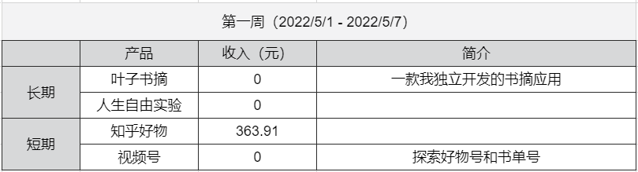

## 人生自由实验-第一周

这周是人生自由实验的第一周。

先上这周的数据。   

知乎好物的收入相比上个月在慢慢回升，这周共计 363.91 元，可以看到大家的购买欲在回升。   
这周主要投入还是在视频号上，尝试了一不同的形式，效果一般，还需要继续探索。    
下周需要去多做一些拆解，看看别人是怎么做的，不能过度自嗨。   

最近在想一个问题，为什么我之前尝试做的那么多事情都没有太好的结果？    
总结下来，有几点原因：   
**1、缺少用户思维**   
不管是之前做小程序、网站、公众号、知乎好物等，没有去想用户需要的是什么，所以做出的产品、文章，不能真正打动用户。    
**2、投入不足**    
不仅是时间，更多的是思考和注意力。   
投入少，自然产出也少。   
**3、不够坚持**    
以前做的这些事情，很多都是一锤子买卖，后面也不再升级维护了，如果能坚持做下去，可能有几个结果还不错。   
毕竟第一版就能成功的产品还是少数。   
**4、缺少反思**   
每件事做完以后，没有复盘，下一个产品依旧如此。   
如果能早些意识到问题，结果应该会更好一些。   
**5、运气**  
现在越来越发现，运气才是真正决定一款产品能否成功的最大因素。  
《精英的傲慢》里提到过，我们目前所受的教育，往往会让我们把成功归功于自己的努力，从而忽视了时机和好运。   
这不是在找借口，而是我们知道了这一点，就无须抱怨，不要再说自己运气不好，把自己能掌控的事情做好就行。    
当然了，运气在一定程度上也是可掌控的，这点我们后面可以再聊。    

目前想到这么多，需要进一步落实下来。   

虽然是实验的第一周，但我已经开始体会到这个实验带来的一些收益了。   
首先是能让我对过去所做事情有了数据层面的清晰认知，不再是模糊的印象。   
其次是强迫自己去思考和复盘。   

大家也可以尝试一下，有意识的去做记录，写出来的东西，思路往往会更清晰。   

上面就是本期实验的所有内容。   
如果你也想过上自由的生活，可以关注看看。   

我们下周见~   

--- 
[b站：人生自由实验-第一周](https://www.bilibili.com/video/BV1Ja411a7Hj)   
[公众号：人生自由实验-第一周](https://mp.weixin.qq.com/s?__biz=MzI3OTcyNjQ5MQ==&amp;mid=2247484091&amp;idx=1&amp;sn=c59f14ea88b06996030bac4ddf0813a1&amp;chksm=eb42124fdc359b592ce284aec43e2271a5be1c5eaac645b4f99dae67c8db77afdb97654676b7&token=1182040112&lang=zh_CN#rd)