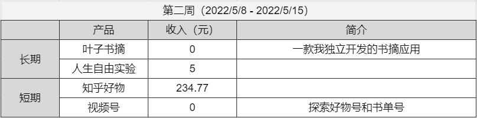

## 人生自由实验-第二周

这周是人生自由实验的第二周。

先上这周的数据。     

这周主要收入来源还是知乎好物，一共 **234.77** 元。    
视频号还在探索中，现在视频的形式明确下来，打算继续堆量试试。     
所以这周做了一套视频的 SOP，下周打算再做一些自动化脚本来辅助，还是要把程序员的优势利用起来。   

这周因为北京疫情的原因，都是居家办公。    
工作也比较繁忙，其他事情上的投入比较少。    
通过建立 SOP 和自动化脚本可以提升一些效率。    
这也是我在公司学到的，**复杂的事情简单化，简单的事情标准化，标准的事情流程化，流程的事情自动化**。    
 
 ---   

上周说了运气，今天继续聊聊吧。    
运气可以理解为成功的概率，所以我们可以通过更多的尝试，去增大概率，从而提升运气。    

不仅是对个人，其实对公司也是一样的。    
像现在一些做短视频的公司，很多时候就是同一套内容，可能开十几个号去碰运气，看看哪个号运气好能冲出来。    
像一些大厂，内部也会投资不少新项目，说白了也是为了博概率，做成了自然是好事，做不成损失也可以接受。     

**所以在我们没有更多资本的时候，多去尝试是一个相对较优的选择，毕竟付出的成本不多，一旦搏成了，回报是很大的。**

这几天回看了前两期的视频，感觉现在的内容确实有点无聊的，相当于每周上来做个汇报。
还得想想怎么让视频内容更充实一些。    
 
 ​
上面就是本期实验的所有内容。   
如果你也想过上自由的生活，可以持续关注。   

我们下周见~   

--- 
[b站：人生自由实验-第二周](https://www.bilibili.com/video/BV1ut4y1x7zW/)   
[公众号：人生自由实验-第二周](https://mp.weixin.qq.com/s?__biz=MzI3OTcyNjQ5MQ==&amp;mid=2247484096&amp;idx=1&amp;sn=dc650084deb3618e8d731e989fb9651f&amp;chksm=eb421234dc359b222109c8e095d59da2bdecf334e35c9e8b2e528084d126fc81c38ff48898bd&token=122934808&lang=zh_CN#rd)