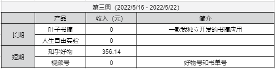

## 人生自由实验-第三周

这周是人生自由实验的第三周。

先上这周的数据。     

这周主要还是知乎的收入，356.14 元。   
视频号还没有起色。    

这周做的事情主要是视频的自动化剪辑。    
目前素材下载、底图的剪辑已经完全自动化了。    
文案的自动化也还在开发中。     
预计最后自动化程度能达到 80%。    

目前做视频号，我觉得主要靠运气。     
一个很明显的现象，同一个视频，不同的人发，效果是不一样的。    
所以需要大量的视频去尝试。    
要提升数量，就需要最大化的减少人工的介入，在质量上一定也是有折损，不过前期也是可接受的。    

总体来看，对个人，视频号的不确定性还是很大的，但是视频号的未来发展是确定的。    

这里再聊聊为什么做视频号吧。也有不少朋友们有疑问，为什么身为程序员，不以写代码为主呢？    
我想说的是：
**首先不要让程序员这个身份限制了自己。**    
我们能做的事情有很多，我们的空间还很大。    
**其次是要用好程序员的优势。**     
在做其他事的时候，我们的逻辑性、技术敏感性、代码能力等等，都会带来很大的优势。
最后，身为程序员，我对代码是真爱，能做成一款自己的独立产品，也是我一直以来的想法，这也是我长期要做的事情，不会放弃的。

上面就是本期实验的所有内容。   
如果你也想过上自由的生活，可以持续关注。   

我们下周见~   

--- 
[b站：人生自由实验-第三周](https://www.bilibili.com/video/bv14r4y147wA)   
[公众号：人生自由实验-第三周](https://mp.weixin.qq.com/s?__biz=MzI3OTcyNjQ5MQ==&mid=2247484101&idx=1&sn=0a9c9a7a24604e5b76dd76153bc8b2f1&chksm=eb421231dc359b27052ff3b41b868ae080a7a9c3d057fcf756a1ade79f026680c83a5a74a539&token=1845278693&lang=zh_CN#rd)