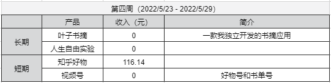

## 人生自由实验-第四周

这周是人生自由实验的第四周。    

先上这周的数据。      

知乎最近临近 618，大部分都是预售单，所以现在统计的收入会下降。    

从实验开始已经过去一个月了。    
从结果上来看，基本上没啥进展。     
看来我们往往会高估一个月自己能做的事情。     

从目前的情况来看，还是缺少更深入的思考。    
就像张一鸣说的那样，**认知是核心竞争力**。    
对一件事情认知越深，方向才能更正确。    
说实话，在代码以外的事情上，我的认知还差得很远。    
那怎么提高认知呢，我觉得这几个词概括得很好：**从书中学，找高人聊，在事上练**。   
总的来说就是不断的去修正自己做事的方法论。    

前几天看到一个观点，我们做事，如果能尝到一点甜头，那么往往会更容易坚持下去。     
假如说我们背一个单词，可以得到十块钱，那么这十块钱就是甜头。    
有了这个甜头，我们才更容易坚持下去。    
但是这个甜头也没有那么好尝。    
大部分人往往坚持不到那个时候。    

顺便可以说说自律，其实那些在你眼前自律的人，对他们自己来说，更大的可能是在享受。    
因为他们尝到了这件事带来的甜头，自然可以坚持下去了。    

就像对有些人来说，可以坚持打游戏，因为他能从打游戏这件事里感受到快乐。     
 
上面就是本期实验的所有内容。   
如果你也想过上自由的生活，可以持续关注。   

我们下周见~   

--- 
[b站：人生自由实验-第四周](https://www.bilibili.com/video/bv11B4y1X76P)   
[公众号：人生自由实验-第四周](https://mp.weixin.qq.com/s?__biz=MzI3OTcyNjQ5MQ==&mid=2247484108&idx=1&sn=8c792efbb877e84bea902b1b56937106&chksm=eb421238dc359b2eba44f24026a48fdf3f5e49690f676782eef0dd1345c67cc4d8204536a729&token=306950814&lang=zh_CN#rd)